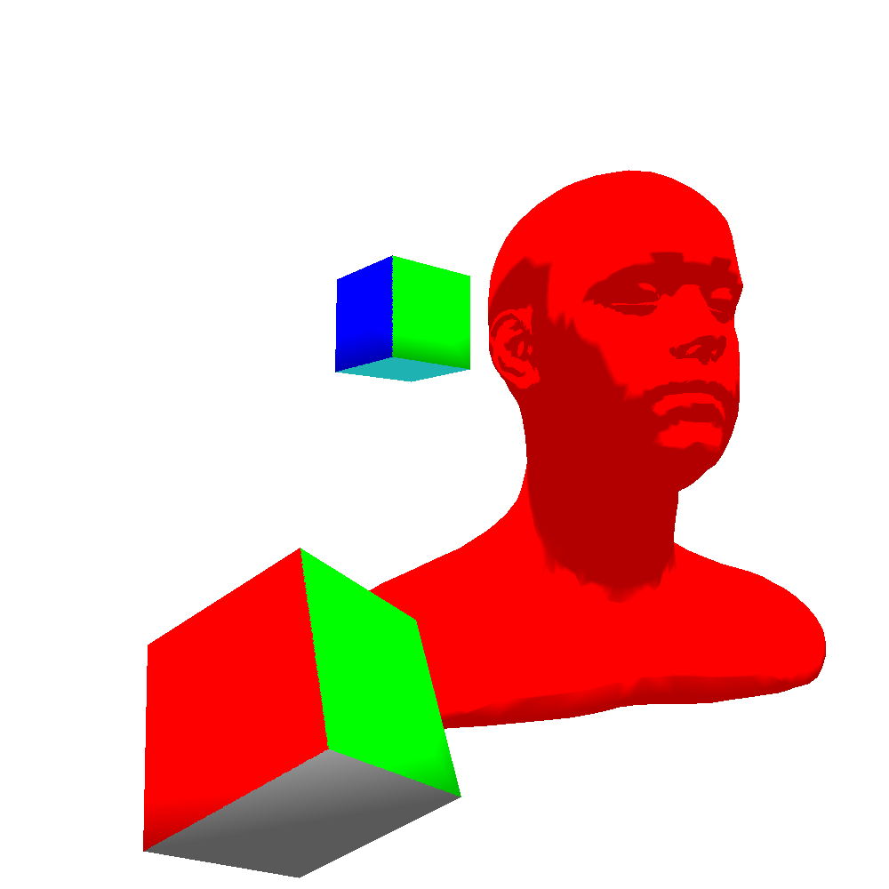

Rasterizer in C++ based off Gabriel Gambetta's
[Computer Graphics from Scratch](https://gabrielgambetta.com/computer-graphics-from-scratch/).



## Build

```sh
cmake -S . -B build
cmake --build build
./build/rasterizer
```
